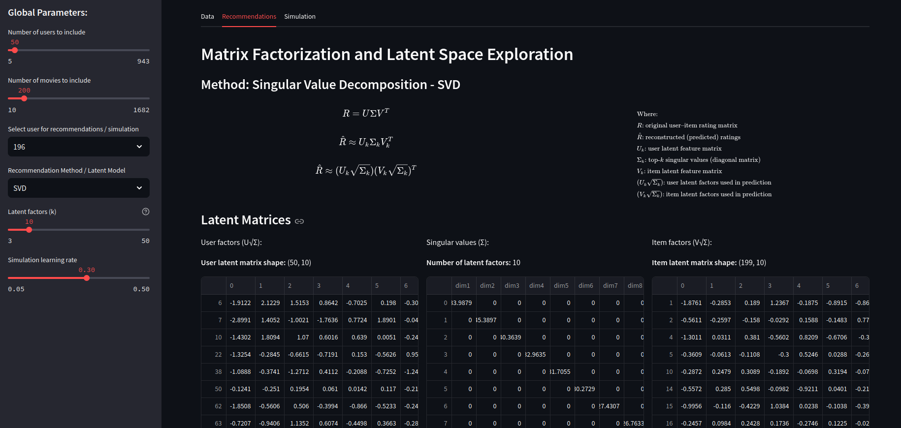
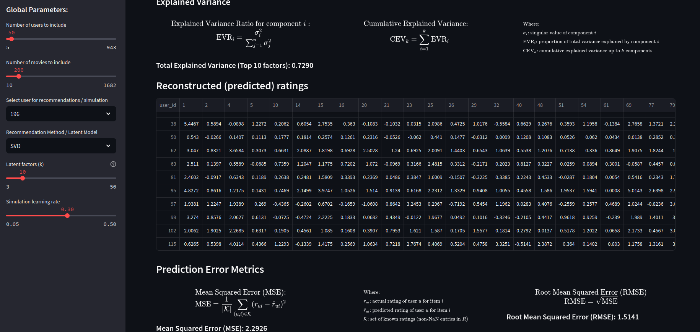

## Abstract

Recommender systems quietly shape what we watch, read, and listen to. On platforms like YouTube, they decide which video auto-plays next and which topics follow us across sessions. 

This article explores how these systems, particularly YouTube's recommendation algorithm, can amplify political bias and even nudge users toward more extreme content. 

Combining a matrix-factorization-based simulation with recent empirical audits and counterfactual studies, we argue that recommendation algorithms are not neutral tools but design artefacts that reflect business incentives, data biases, and societal power structures. 

We conclude by discussing how regulation, technical design choices, and informed user behaviour can work together to steer these systems toward more democratic outcomes.

---

## 1. Why Recommender Systems Matter Today

### 1.1 A Polarized World Curated by Algorithms

Artificial intelligence recommender systems have fundamentally transformed how individuals discover and consume information. 

YouTube, the most popular video platform globally, is a prime example. With around 81% of the U.S. population using the platform and about 70% of watch time driven by algorithmic recommendations, YouTube's recommender has become one of the most influential information gatekeepers in contemporary society.

This power operates in a context of deep political polarization. The gap between left and right on key issues has widened, hostility between partisan groups has increased, and support for political violence is not negligible. 

Social media and recommendation algorithms are regularly accused of locking users into filter bubbles and leading them down rabbit holes of increasingly ideological or conspiratorial content. 

YouTube, in particular, has been labelled "the great radicalizer," a platform whose algorithmic logic allegedly pushes users from mainstream content toward increasingly extreme material [[1]](https://www.niemanlab.org/reading/youtube-the-great-radicalizer/), [[2]](https://www.nytimes.com/interactive/2019/06/08/technology/youtube-radical.html)

---

### 1.2 The Core Question: Are Algorithms Driving Radicalization?

At the heart of the debate lies a deceptively simple question: **do recommendation algorithms systematically direct users toward extreme, conspiratorial, or otherwise problematic content?**

Answering this requires unpacking what we call the **loop effect**, a feedback cycle with four interacting components:

#### Understanding the Loop Effect in Recommendation Algorithms

At the center of current debates on digital media lies a central question: do recommendation algorithms actively steer users toward more extreme, conspiratorial, or otherwise harmful content?

Addressing this issue requires understanding the **loop effect**, a self-reinforcing cycle generated by the interaction of user behaviour, social networks, and algorithmic design with four interacting components:

   
  <b>Fig. 1.</b> The Loop Effect – from <a href="https://arxiv.org/abs/2203.10666">[4] Haroon et al, 2022</a>

1. **Selective exposure:** Users tend to consume information that matches their pre-existing views.  
The first component, selective exposure, reflects users’ propensity to engage with information that confirms their existing beliefs. Although the degree of intentional “seeking out” like-minded content is contested, individuals consistently show a higher likelihood of consuming ideologically aligned material, which can heighten polarization and increase hostility toward political out-groups.

2. **Homophily:** Social networks, online and offline, are biased toward like-minded connections.  
Homophily adds a second layer to this dynamic. Social networks form predominantly among individuals with similar socio-demographic characteristics, behaviours, and political orientations. On social media, users disproportionately follow and exchange information with ideologically similar others. These homophilous networks act as filters that narrow exposure to diverse viewpoints, intensifying the effects of selective exposure. While most people do not inhabit political echo chambers, a smaller and highly engaged subset does, and its behaviour disproportionately shapes the online information environment.

3. **Filter bubbles:** Personalization algorithms learn from this biased behaviour and recommend more of the same.  
A third factor, the filter bubble, arises from the design choices underpinning recommendation algorithms. To maximize engagement, these systems personalize content based on users’ prior activity and the behaviour of similar users in their networks. Over time, the system internalizes an increasingly narrow picture of a user’s interests, leading to recommendations that mirror and sometimes amplify past engagement patterns. For certain users, this can significantly tighten the ideological boundaries of the content they encounter.

4. **Feedback:** As users follow these recommendations, their future options and sometimes their beliefs become more homogeneous.  

##### The Self-Loop (Loop Effect)

These components converge in what we call the **self-loop** or **loop effect**. 
This mechanism operates as a closed, iterative cycle:

1. Users initially choose content aligned with their beliefs.  
2. Their homophilous networks reinforce that exposure by circulating similar material.  
3. The algorithm learns from this interaction history and delivers even more ideologically consistent content.  
4. Users engage with these new recommendations, feeding the cycle once again.

Each iteration strengthens the signals the system uses to predict future engagement, gradually narrowing the informational environment. The loop effect therefore embodies a compounding process in which user behaviour and algorithmic outputs become mutually reinforcing, increasing the likelihood of ideological homogeneity and reducing exposure to diverse viewpoints.

#### Empirical Evidence

Empirical studies show that this process is nuanced 
Earlier audits found that platforms like YouTube systematically amplified ideologically congenial content, especially for right-leaning users.[[3]](https://doi.org/10.1073/pnas.2213020120).

More recent counterfactual analyses [[6]](https://doi.org/10.1073/pnas.2313377121), however, indicate that after major algorithmic adjustments in 2019, user preferences may play a more decisive role than algorithmic bias alone.  

The most accurate interpretation is thus a hybrid one: **the trajectory of online radicalization is shaped not by algorithms or users independently, but by their continuous co-production within this self-reinforcing loop.**

---

### 1.3 Key Stakeholders in This Ecosystem

Several actors shape and are shaped by these algorithms:

| Stakeholder | Role | Incentives & Constraints |
|---|---|---|
| **YouTube/Google** | Platform operator | Optimizes for engagement and advertising revenue; profit-driven prioritization of attention-capturing content |
| **Users** | Content consumers | Most consume mainstream content; small, highly engaged subset encounters extreme material; preferences directly train models |
| **Creators** | Content producers | Respond to platform incentives; provocative, emotionally charged content often performs better, reinforcing supply |
| **Regulators** | Governance bodies | EU Digital Services Act (DSA) requires transparency and non-personalized alternatives; first serious regulatory attempt |
| **Researchers** | Knowledge producers | Develop auditing methods (sock-puppet experiments, counterfactual bots) to isolate algorithmic influence from user choice |

---

## 2. How Modern Recommender Systems Work

### 2.1 From Click Logs to Latent Factors

Recommender systems predict which items a user is likely to engage with by exploiting patterns in historical interactions. 

On platforms such as YouTube, Netflix, and Spotify, these interactions—views, clicks, dwell time, ratings, or other engagement signals, are represented in a sparse user–item matrix $R$, where most entries are unobserved.  

**The central modelling task is to predict which unobserved entries are likely to be high, thereby generating personalized recommendations.**

#### 2.1.1 Recommender System Strategies

Broadly speaking, recommender systems operate through one of two core strategies: **content-based filtering** or **collaborative filtering**.[[7]](https://ieeexplore.ieee.org/document/5197422)

**Content-based methods** rely on descriptive attributes of items and users—such as genre, cast, or demographic traits—to identify suitable matches. They perform well even when dealing with new users or items, but depend on extensive metadata and careful feature construction.

**Collaborative filtering** follows a different logic by drawing exclusively on historical user–item interactions, such as ratings or viewing behaviour. By identifying patterns shared across many users, it infers underlying preferences without requiring explicit item descriptions. Although often more accurate and broadly applicable than content-based approaches, collaborative filtering is limited when little interaction data are available, making it vulnerable to the *cold-start* problem.

Within collaborative filtering, two principal methodological families exist:

-  ##### Neighborhood Methods #####  
    Focus on explicit similarity relationships either between users or between items:

    - User-oriented approaches: The system predicts a user’s preference by identifying like-minded users who have rated similar items. 

    - Item-oriented approaches: The system examines which items tend to receive similar ratings from the same users; recommendations are then derived from the nearest “neighbor” items a user has already interacted with.  

    *Example:* If a user has rated several war or Spielberg films highly, a neighborhood method might infer a preference for *Saving Private Ryan*  by observing that these films cluster together in terms of user ratings.

- ##### Latent Factor Models
    Latent factor models attempt to explain rating behaviour through a set of underlying dimensions—often between 20 and 100—learned directly from patterns in the data. Instead of relying on explicit similarity, these models embed both users and items in a latent space where each factor captures an abstract aspect of taste or content.  

    For movies, latent factors might represent distinctions such as comedy versus drama, action intensity, or family orientation, but can also capture subtle or non-interpretable dimensions.  
    A user’s predicted rating emerges from the alignment (typically via dot product) between the user’s and the item’s positions in this latent space.

---

#### 2.1.2 Matrix Factorization

Matrix factorization is one of the most successful implementations of latent factor models. It represents both users and items as vectors in a shared factor space, with strong alignment indicating a high predicted preference. It assumes that both users and items can be embedded in a shared low-dimensional latent space.

In its basic form, the interaction matrix is approximated as:

$$
R \approx U V^T
$$

where $U \in \mathbb{R}^{m \times f}$ contains user latent factors and $V \in \mathbb{R}^{n \times f}$ contains item latent factors. Each user $u$ is associated with a vector $p_u$ and each item $i$ with a vector $q_i$, and the predicted interaction is given by:

$$
\hat{r}_{ui} = p_u^T q_i
$$

The latent dimensions capture underlying characteristics—such as taste, mood, genre, or political orientation—that may not be explicitly annotated but can be inferred from collective behaviour.  

The latent space representation provides a **geometric perspective**: users and items are points in an $f$-dimensional space, and the dot product of their vectors approximates user–item affinity. Items positioned closely along certain dimensions share latent properties, while users are located near items matching their preferences.

---

#### 2.1.3 Matrix Factorization Algorithms

Several algorithms implement matrix factorization for collaborative filtering, differing in estimation strategy, regularization, and computational scalability. 

In this project, we employ  three different matrix factorization techniques/algorithms:

- **Singular Value Decomposition (SVD)**
- **Alternating Least Squares (ALS)**
- **Probabilistic Matrix Factorization (PMF)**.

---

##### Singular Value Decomposition (SVD)

SVD decomposes a fully observed matrix into orthogonal components:

$$
R = U \Sigma V^T
$$

where $\Sigma$ is a diagonal matrix of singular values.

Truncating to the top $f$ singular values yields the rank- $f$ approximation:

$$
R_f = U_f \Sigma_f V_f^T
$$

This produces a latent-space embedding: the rows of $U_f \Sigma_f^{1/2}$ represent users and the rows of $V_f \Sigma_f^{1/2}$ represent items in the same $f$-dimensional space.

Proximity in this space reflects similarity in preferences.  

Classical SVD requires dense matrices and is unsuitable for sparse recommender data without adaptations such as **SVD++** or imputation.

---

##### Alternating Least Squares (ALS)

ALS fits the factorization model directly on observed ratings by minimizing a regularized least squares objective:

$$
\min_{U,V} \sum_{(u,i)\in \kappa} (r_{ui} - p_u^T q_i)^2 + \lambda (\|p_u\|^2 + \|q_i\|^2)
$$

where $\kappa$ denotes known interactions.

ALS alternates between solving for all user vectors $p_u$ while fixing item vectors, and vice versa. 

After convergence, $U$ and $V$ form the latent space representation: each row corresponds to a user or item in an $f$-dimensional space, and distances and directions capture similarity patterns.  

ALS is highly scalable, parallelizable, and well-suited to sparse data or implicit feedback.

---

##### Probabilistic Matrix Factorization (PMF)

PMF models observed ratings probabilistically:

$$
r_{ui} = p_u^T q_i + \epsilon_{ui}, \quad \epsilon_{ui} \sim \mathcal{N}(0, \sigma^2)
$$

with Gaussian priors on latent factors:

$$
p_u \sim \mathcal{N}(0, \sigma_p^2 I), \quad q_i \sim \mathcal{N}(0, \sigma_q^2 I)
$$

Maximizing the posterior corresponds to minimizing the regularized squared error, similar to ALS, but with a probabilistic interpretation.

The latent space is defined by the learned posterior means of $p_u$ and $q_i$. 

PMF naturally supports uncertainty estimation and can be extended to Bayesian formulations.

---

#### Performance Evaluation (RMSE and MSE)

In the context of matrix factorization techniques (such as SVD, ALS, or PMF), the performance of the model can be evaluated using prediction error metrics like **Mean Squared Error (MSE)** and **Root Mean Squared Error (RMSE)**. These metrics quantify how well the model's predicted ratings match the actual ratings in the dataset, focusing on the observed ratings (those that are available in the dataset).

##### 1. Mean Squared Error (MSE)

The **Mean Squared Error (MSE)** is one of the most common metrics for evaluating the performance of a model. It measures the average of the squared differences between the actual (true) ratings and the predicted ratings. Lower MSE values indicate better model performance.

$$
\mathrm{MSE} = \frac{1}{N} \sum_{i=1}^{N} (r_{ij} - \hat{r}_{ij})^2
$$

Where:
- $N$ is the total number of observed ratings.
- $r_{ij}$ is the actual rating of user $i$ for movie $j$.
- $\hat{r}_{ij}$ is the predicted rating for user $i$ for movie $j$.

1. Identify the set of ratings that are actually available in the dataset (non-missing or non-NaN).
2. Compute the squared error for each observed rating: $(r_{ij} - \hat{r}_{ij})^2$.
3. Take the average of all the squared errors for the observed ratings.

##### 2. Root Mean Squared Error (RMSE)

The **Root Mean Squared Error (RMSE)** is a more interpretable metric because it has the same units as the original ratings (compared to MSE, which is in squared units). RMSE is the square root of the MSE, and it gives an indication of the typical magnitude of the error in the predicted ratings.

$$
\mathrm{RMSE} = \sqrt{\mathrm{MSE}} =
\sqrt{\frac{1}{N} \sum_{i=1}^{N} (r_{ij} - \hat{r}_{ij})^2}
$$

Where:
- $\mathrm{MSE}$ is the mean squared error (from the equation above).

1. Compute the MSE using the observed ratings (just like the MSE calculation).
2. Take the square root of the resulting MSE value.

##### Comparison of ALS, SVD, and PMF in Terms of MSE and RMSE

- **SVD** uses a deterministic factorization and generally minimizes the Frobenius norm of the difference between the actual and predicted ratings, leading to a low MSE and RMSE. It works well when the data is relatively dense or when using a small subset of users and items.

- **ALS** is an iterative optimization method that solves for user and item latent factors alternately. Like SVD, it minimizes the squared error for observed ratings, but the alternating optimization makes it more scalable for large datasets, particularly when the data is sparse.

- **PMF** takes a probabilistic approach, which can be more robust in situations where noise or uncertainty is significant. Like SVD and ALS, it minimizes the squared error (through a log-likelihood approach), but the probabilistic formulation can lead to better generalization in sparse datasets, as it incorporates uncertainty in the model’s predictions.

In all three techniques (SVD, ALS, and PMF), the underlying goal is to minimize the **MSE** or **RMSE** by approximating the original rating matrix $R$ with the product of latent factors. All three methods are designed to produce low MSE and RMSE, which ultimately means better recommendations by more accurately predicting ratings for unseen items.

---

**Matrix Factorization Techniques Comparison**

| **Method** | **Estimation** | **Latent Space Representation** | **Strengths** | **Limitations** | **Estimation Strategy** | **Regularization** | **Scalability** |
|------------|----------------|---------------------------------|---------------|-----------------|-------------------------|---------------------|-----------------|
| **SVD**    | Classical decomposition (dense matrix) | $U_f \Sigma_f^{1/2}$ and $V_f \Sigma_f^{1/2}$ | Optimal low-rank approximation; simple | Not suitable for sparse data; requires imputation/adaptation | Global optimization via matrix factorization (best fit for entire matrix) | Regularization in latent factors via imputation/SVD++ | Expensive for large, sparse datasets (need for adaptation) |
| **ALS**    | Alternating regularized least squares | Rows of $U$ and $V$ are points in latent space | Scalable; parallelizable; handles implicit feedback | Sensitive to hyperparameters; less statistically grounded | Local optimization (alternating between user/item factorization) | Explicit regularization in the objective function | Highly scalable and parallelizable, efficient for sparse data |
| **PMF**    | Probabilistic posterior maximization | Posterior means of $p_u$ and $q_i$ define latent space | Principled regularization; models uncertainty | Computationally heavier; requires careful tuning | Probabilistic modeling of ratings with Gaussian priors | Regularization via Gaussian priors on latent factors | Slower than ALS due to probabilistic model complexity, but parallelizable |

---

## 2.2 Design Choices That Create Feedback Loops

Recommendation algorithms do not operate in isolation; their design choices interact with user behaviour and social structure to create feedback loops.

#### 2.2.1 Objective Functions and Personalization

Recommenders optimize engagement metrics such as watch time, clicks, or session length. 

In latent factor models, this corresponds to adjusting vectors so that:

$$
\hat{r}_{ui} = p_u^T q_i
$$

aligns with observed interactions.  

High-engagement items — often those that align with users’ existing preferences — receive stronger latent factor weights, making them more likely to appear in recommendations.

Personalization leverages the latent space: users near similar items or other users receive similar recommendations. 

Over time, repeated engagement strengthens these local clusters.

---

#### 2.2.2 Heterogeneous Recommendation Surfaces

Platforms often use multiple recommendation surfaces, each applying different weighting strategies:

- **Homepage:** mixes popular and personalized content.  

- **Up-next / Auto-play:** emphasizes immediate engagement, reinforcing narrow sequences of content.  

- **Search-based:** personalized by query history but still influenced by latent proximity.  

Even with identical factor matrices, these surfaces produce different reinforcement dynamics in latent space.

---

#### 2.2.3 Interaction with Latent Space

The latent space provides a geometric interpretation of feedback dynamics:

- **Item clustering:** items with similar latent vectors cluster along shared dimensions.  
- **User drift:** users’ vectors shift toward clusters corresponding to consumed content.  
- **Neighborhood contraction:** recommendations concentrate around local clusters, narrowing exposure to diverse content.  

In the simulation, this structure allows us to observe how collaborative filtering in latent space reproduces concentration of recommendations and homophily-driven alignment along ideological axes.

This combination of selective exposure, homophily, and latent-space-based personalization forms the **self-loop mechanism**: each interaction iteratively strengthens the latent-space alignment between users and ideologically similar items.

Empirical audits of large platforms like YouTube show that such loops can increase the prevalence of extreme or highly partisan content for a subset of users, even though global exposure remains diverse.[[5]](https://gifct.org/wp-content/uploads/2022/07/GIFCT-22WG-TR-Empirical-1.1.pdf)

Across all methods, the latent space allows geometric reasoning about users and items:

- **Items:** Points whose positions encode combinations of latent traits. Items close together in this space share similar characteristics.  
- **Users:** Points encoding preferences along the same latent axes. Users near an item vector are predicted to engage with that item.  
- **Dot product:** Interaction strength is approximated by the inner product of user and item vectors. High alignment indicates high predicted preference.

This representation is central for the project: it provides a structured way to simulate recommendation dynamics, capture homophily, and analyze how personalization can concentrate exposure around specific political orientations, reproducing the feedback loop mechanisms observed on platforms like YouTube.

---

#### 2.2.4 Implications for Simulation

By embedding users and items into a latent factor space using SVD, ALS, or PMF, our simulation can reproduce these dynamics. The latent vectors allow the model to:

- Track how users’ positions evolve in response to repeated exposure to content clusters.  
- Examine how local neighborhoods in latent space shrink or shift over time.  
- Quantify the impact of algorithmic design choices (e.g., weighting functions, personalization strength) on the concentration of recommendations.  

In this framework, the latent space is not merely a mathematical abstraction; it is a tool for modeling how collaborative filtering interacts with social behaviour to generate feedback loops, providing insight into the mechanisms by which recommender systems may amplify ideological homogeneity.

---

## 2.3 Our Simulation: Matrix Factorization in a Political Toy World

To make these ideas tangible and engage our audience with the mechanisms of algorithmic bias, we developed an **interactive Streamlit-based demo**

This project adopts collaborative filtering through matrix decomposition and latent-space modelling because these methods offer a powerful framework for analyzing how recommender systems may reinforce ideological tendencies. 

By extracting latent dimensions of taste and item similarity directly from behavioural data, matrix factorization exposes how user interactions can structure the recommendation landscape. 

In our simulation, this latent representation illustrates how mechanisms such as **selective exposure and homophily can gradually concentrate recommendations around specific political orientations**, mirroring dynamics observed on large-scale platforms like YouTube.

---

#### 2.3.1 Dataset and Political Mapping

To make these dynamics concrete, our project implements a recommender simulation based on the **MovieLens 100K dataset**. 

Although using a YouTube dataset might seem ideal, full user interaction data is not publicly accessible due to privacy restrictions. 

Moreover, such datasets are extremely large and require extensive preprocessing. 

Using **MovieLens 100K** allows the team to simulate different user personalities and interactions, making it easier to demonstrate the effects of algorithmic bias and feedback loops in an educational and interpretable setting.

The **MovieLens 100K** dataset is a widely used benchmark for developing and evaluating recommender systems. 

It contains exactly **100,000 explicit user–item interactions**, where **943 users** rate **1,682 movies** on a discrete 1–5 scale. 

In addition to the ratings themselves, the dataset provides a compact set of auxiliary attributes—such as timestamps, basic demographic indicators for users, and metadata for movies—amounting to roughly 31 fields depending on the variant used and the preprocessing applied.

A distinctive feature of **MovieLens** is its structured representation of movie genres. 

Each film is assigned one or more genre labels from a predefined set, encoded as binary indicator variables. 

For this project, these genre labels provide a bridge between the nonpolitical nature of the dataset and the political dynamics we aim to simulate. 

By mapping each genre to a corresponding political intensity category, we construct an interpretable proxy for ideological content. 

The mapping is defined as follows:

- **Neutral genres:** Comedy, Animation, Children’s, Musical, Drama, Romance, Sci-Fi, Fantasy, Documentary, Unknown  
These categories generally reflect lighthearted, family-oriented, informational, or escapist themes that do not carry inherent political connotations.

- **Mildly political genres:** Action, Adventure, Thriller, Crime, Mystery, Action-Adventure/Other  
These genres commonly involve conflict, societal tension, moral dilemmas, or adversarial framing, making them suitable as proxies for low-intensity political content.

- **Extreme genres:** War, Film-Noir, Horror  
These categories are characterized by depictions of violence, existential conflict, ideological narratives, or psychologically intense themes. They serve as analogues for high-intensity or polarizing political content.

This mapping is obviously stylized but serves as a proxy to observe how an algorithm shifts a user’s recommendations along a neutral–extreme axis.

Although **MovieLens** itself contains no political material, this genre-to-intensity mapping enables the modeling of user preferences along a synthetic ideological axis. 

By assigning each film a political “load” based on its genres, and by simulating users with differing appetites for neutral, mildly political, or extreme content, the dataset becomes a controlled environment in which to study how collaborative filtering, matrix factorization, and feedback mechanisms can distort, amplify, or homogenize exposure patterns.

Using **MovieLens** in this way provides a clean and interpretable test bed for analyzing algorithmic bias and reinforcement dynamics without the noise, opacity, or confounding factors of real political platforms.

#### 2.3.2 Application Overview

In the Streamlit application which is designed for exploring and simulating a movie recommendation system using matrix factorization techniques such as **SVD**, **ALS**, and **PMF**, users can view and interact with movie data, make predictions using latent models, simulate the evolution of their preferences over time, and visualize results in 3D latent spaces.  

The main sections are organized into **three functional tabs.**

##### Tabs and Features

 1. **Data Tab**
     - **Display Original Dataset**: View the original MovieLens dataset with user, movie, and rating information.
     - **Category Mapping**: Shows a mapping of movie genres to political categories (e.g., neutral, mildly political, extreme).
     - **User-Item Matrix**: Visualize the ratings matrix for users and movies, highlighting how sparse the data is and showing how movies are rated by users.
     - **Category Distribution**: Displays a bar chart of the category distribution in the full dataset as well as for the filtered data based on the selected users and movies.

    

      

         
        <b>Fig. 2.</b> Application Layout - Data Tab
      

      

         
        <b>Fig. 3.</b> Data Tab: The User-Item Matrix
      

    

 2. **Recommendations Tab**
     - **Matrix Factorization**: Apply matrix factorization methods (SVD, ALS, PMF) to decompose the rating matrix and generate recommendations.
     - **Latent Factor Visualization**: Display the user and movie latent factor matrices obtained after performing matrix factorization.
     - **Predicted Ratings**: Show the predicted ratings for unrated movies based on the selected latent model.
     - **Prediction Error Metrics**: Display RMSE (Root Mean Squared Error) and MSE (Mean Squared Error) to assess the performance of the recommendations.
     - **Top-20 Recommendations**: Display the top-20 recommended movies for the selected user and show their category distribution (neutral, mildly political, extreme).
     - **3D Latent Space Visualization**: Visualize the latent space in 3D, showing the relative positions of movies and the user, as well as top-20 recommendations in relation to the user's preferences.

    

      

         
        <b>Fig. 4.</b> Recommendation Tab - Matrix Factorization
      

      

         
        <b>Fig. 5.</b> Recommendation Tab - Predictions Matrix
      

    

    

      

         
        <b>Fig. 6.</b> Recommendation Tab - Top 20 - User Recommendations
      

      

         
        <b>Fig. 7.</b> Recommendation Tab - 3D Latent Space Visualization 
      

    

 3. **Simulation Tab**
     - **Latent Drift Simulation**: Simulate how a user's preferences drift over time as they interact with different movies. This feature tracks and visualizes the evolution of the user's latent vector and their changing preferences.
     - **Interactive Movie Selection**: Users can interact with the top-10 recommended movies. Each click updates the user’s preferences in the latent space by simulating a shift toward the selected movie's latent representation.
     - **Recovery Action**: Simulate watching a "neutral" movie to revert the user’s preferences toward neutrality (a balancing action).
     - **Trajectory Visualization**: Track and visualize the user’s trajectory in the latent space as they interact with movies. This shows how the user’s preferences evolve over time.
     - **UMAP Projection**: Use UMAP to visualize the user’s latent drift and movie clusters in a reduced 3D space, helping to explore the overall structure of movie preferences.
     - **Radicalization Index**: Compute and display a Radicalization Index based on the political categories of the top-10 recommended movies. It shows how the recommendations are distributed across categories like "neutral," "mildly political," and "extreme."
      - **Category Distribution in Recommendations**: A bar chart showing the distribution of categories (neutral, mildly political, extreme) in the top-10 recommendations.
      - **Category-Biased KNN Graph**: Visualizes a K-nearest neighbor (KNN) graph of movies with respect to their latent factors, highlighting how the top-10 recommended movies relate to each other and the user's trajectory. The graph considers movie categories (neutral, political, extreme) to enhance the visualization of movie similarities.

---

##### Simulation Parameters

The sidebar allows users to define how many users and movies are included in the simulation, choose the matrix factorization method (SVD, ALS, or PMF), and select the number of latent factors and learning rate for simulations.  
Latent factors are a key parameter for controlling the quality and specificity of the recommendations. The simulation learning rate controls how much the user preferences change during the simulation.  
Users can select a user for recommendations and simulation from the available subset, making it possible to simulate personalized recommendations.  
The dynamic calculation of the number of latent factors ensures that users only select feasible numbers of latent factors, based on the chosen subset of users and movies.

In the sidebar, users can control the following simulation parameters to customize the recommendation process and preference simulation:

1. **Number of Users to Include:**
   - **Control**: Slider to select how many users to include in the subset.
   - **Range**: From 5 to the total number of unique users in the dataset. Default: 50.

2. **Number of Movies to Include:**
   - **Control**: Slider to select how many movies to include in the subset.
   - **Range**: From 10 to the total number of unique movies in the dataset. Default: 200.

3. **Select User for Recommendations:**
   - **Control**: Dropdown menu to select the user for whom to generate movie recommendations and simulate interaction.
   - **Range**: Based on the subset of users chosen via the number of users slider.

4. **Recommendation Method / Latent Model:**
   - **Control**: Dropdown menu to select the matrix factorization method for generating recommendations.
   - **Options**: SVD, ALS, PMF.
   - **Default**: SVD.

5. **Latent Factors:**
   - **Control**: Slider to select the number of latent factors (dimensions) used in the matrix factorization model. This controls the dimensionality of the latent space representation.
   - **Range**: Based on the selected method and data. The slider dynamically adjusts the max number of latent factors  depending on the number of users and movies.
   - **Default**: A value that is dynamically set based on the data and method.

6. **Simulation Learning Rate:**
   - **Control**: Slider to adjust the learning rate for preference drift simulations. A higher learning rate means the user's preferences will evolve more quickly.
   - **Range**: From 0.05 to 0.5. Default: 0.3.

## 2.4 Practical Activity: Interactive Radicalization Index Demo

The  **Interactive Streamlit-based demo**, is available at  

[SVD Recommendation System · Streamlit](https://app-recommender-demo-jmes3suofb6rlwktepdkss.streamlit.app/).  

It visualizes how recommender systems respond to user interactions and shift recommendation profiles along a political spectrum.

#### Demo Features

The application provides five key interactive capabilities:

1. **3D Latent Space Visualization**: Users and items are visualized in a reduced 3-dimensional latent space, showing how similar items cluster based on their learned representations. This makes abstract concepts like "latent factors" concrete and visible.

2. **Interactive Item Selection**: Users can click on neutral, mildly political, or extreme items and observe in real-time how the model updates the user's latent profile. This demonstrates the mechanism of the feedback loop in action.

3. **Radicalization Index Tracking**: A dynamic metric tracks the proportion of extreme items in the current top-10 recommendations. As users repeatedly interact with extreme content, this index increases, mirroring patterns observed in real YouTube audits.

4. **Algorithm Comparison**: The interface allows switching between different matrix factorization approaches (SVD, PMF, and ALS) to compare how each algorithm responds to identical interaction sequences. This reveals that algorithmic design choices matter—different approaches produce different trajectories.

5. **Recovery Mechanisms**: Users can deliberately consume neutral content and observe whether their recommendation profile rebalances. This exploration reveals an important asymmetry: while radicalization can accelerate quickly, depolarization typically occurs more slowly, reflecting the "stickiness" of extreme content preferences.

#### Key Insights from Simulation

Even in this simplified toy world, three critical patterns emerge:

- **Rapid Drift**: Repeated selection of extreme items gradually increases the radicalization index. The latent vector shifts toward the extreme region of the space, pulling all future recommendations with it.

- **Asymmetric Recovery**: Neutral interactions can pull the index back down, but typically more slowly than the radicalization process. This mirrors patterns observed in real YouTube audits, where moving users away from problematic content proves more difficult than the initial attraction.

- **Algorithmic Amplification**: The algorithm does not create extreme content consumption; rather, it amplifies and accelerates it. Users must first encounter extreme material for the algorithm to reinforce its presence, but once they do, the system makes that material increasingly prominent.

These observations underscore a fundamental insight: **recommendation algorithms are not autonomous agents but rather efficiency mechanisms**. They make visible and actionable what users might seek on their own, but in doing so, they amplify the consequences of individual choices across millions of users.

---

## 3. What We Learn from Outcomes and Implications

### 3.1 The Upside: Navigation, Personalization, Scale

It is important to acknowledge that recommender systems deliver genuine value:

**Navigation**: They help users navigate enormous catalogues. Without some form of algorithmic triage, platforms like YouTube would be nearly unusable.

**Personalization**: Good recommendations surface content that users might never have found manually. For many, this is experienced as serendipity rather than manipulation.

**Scalability**: Matrix factorization and related methods allow platforms to operate at web scale, computing recommendations for millions of users and items in near real-time.

### 3.2 The Downside: Filter Bubbles and Radicalization Pathways

Yet these very mechanisms also have serious downsides:

**Filter bubbles for politically engaged users**: While most users see a relatively mixed information diet, politically active partisans are more likely to inhabit echo chambers, both in their social networks and their recommender-driven feeds. This small group is often more vocal, more politically engaged, and more influential than average citizens.

**Algorithmic radicalization pathways**: Empirical evidence shows that some users move from centrist to more extreme channels over time. Our simulation shows the mechanism: when the model updates user factors after every extreme click, the latent profile shifts in that direction, and so do future recommendations.

**Right-leaning asymmetry**: Multiple audits find stronger amplification of congenial and problematic content for right-leaning users than for left-leaning ones. This asymmetry is not yet fully understood, but may relate to different content supply patterns across the ideological spectrum, the higher engagement provoked by certain right-wing narratives, or incomplete enforcement of platform policies.

**Normalisation through exposure**: Even if 97.5% of recommendations do not point to problematic channels, the fact that over a third of users eventually encounter such channels somewhere in their recommendation trails matters. Repeated incidental exposure can gradually shift what counts as normal or acceptable.

### 3.3 Opacity and Accountability Gaps

From the outside, YouTube's recommender is effectively a black box. Researchers can log what is recommended and what gets watched, but cannot directly see the internal model structure or objective functions. This opacity has several consequences:

- Platforms can claim that certain policy changes (e.g., reducing borderline content) had large positive effects without independent verification.
- Users cannot meaningfully understand or contest why specific items are recommended.
- Regulators struggle to assess systemic risks or enforce standards.
- Causal responsibility for harms becomes hard to attribute.

### 3.4 A Supply-and-Demand Perspective

A helpful way to cut through the algorithm vs. users dichotomy is to adopt a **supply-and-demand lens**:

- **Supply**: Extremist and conspiratorial creators produce content that is engaging to certain audiences, sometimes financially rewarded through monetization.
- **Demand**: Users with pre-existing grievances, prejudices, or curiosity seek out or dwell on such content.
- **Matching**: Recommender systems optimised for engagement become increasingly efficient at connecting this supply and demand.

In this view, the algorithm amplifies and structures existing dynamics rather than creating them ex nihilo. Effective interventions therefore need to address:
- **Supply** (e.g., moderation, demonetization)
- **Demand** (e.g., media literacy, social support)
- **The matching mechanism** (e.g., recommender design and constraints)

---

## 4. Why This Matters for Society and Governance

### 4.1 Media Narratives and Platform Responses

High-profile journalism has played a major role in framing YouTube as a radicalizing force. Stories like "The Making of a YouTube Radical" (New York Times) and essays such as Zeynep Tufekçi's "YouTube, The Great Radicalizer" cast recommender systems as almost autonomous agents driving individuals toward extremism.

In response to mounting criticism, YouTube announced a **Four Rs policy framework**:

1. **Remove**: Content that clearly violates policies.
2. **Raise up**: Authoritative sources in recommendations.
3. **Reward**: Trusted, policy-compliant creators.
4. **Reduce**: The spread of borderline content (videos that do not quite violate rules but are considered harmful).

YouTube claims these measures significantly reduced views of borderline content, but independent verification is limited due to black-box constraints.

### 4.2 Regulation: The Digital Services Act and Beyond

The European Union's **Digital Services Act** directly targets recommender systems. Key requirements include:

- Platforms must describe the main parameters of their recommender systems in plain and intelligible language.
- Very large online platforms must provide at least one non-profile-based recommendation option (e.g., chronological ordering).
- Regulators receive stronger auditing and data access powers.

The EU's **AI Act**, while not ultimately categorising recommenders as high-risk systems, further signals regulatory concern about opaque, large-scale algorithmic systems.

### 4.3 Challenging the Myth of Algorithmic Neutrality

The idea that algorithms are neutral, objective tools is increasingly untenable. Design decisions embed human values at multiple levels:

**Objective choice**: Engagement optimisation vs. accuracy, diversity, or civic value.

**Preference modelling**: Users are treated as isolated individuals rather than socially embedded agents whose preferences evolve.

**Content ranking**: Default favouring of popular or trending items can systematically marginalise minority viewpoints.

**Training data**: Historical patterns of inequality and discrimination are reproduced in model behaviour.

These are not mere implementation details—they are normative choices with political and ethical consequences.

### 4.4 Agency, Determinism, and Time

Counterfactual bot studies remind us that users retain significant agency. Many radicalization trajectories involve users actively searching for, subscribing to, or repeatedly selecting extreme content. The algorithm is complicit but not omnipotent.

At the same time, the effects of recommenders change over time. Pre-2019 YouTube likely behaved differently from the post-2019 version. This means that empirical results must always be interpreted in temporal context:

- Platform changes can and do alter outcomes, which is evidence that different designs are possible.
- Long-term research and monitoring are essential to track the impact of both platform self-regulation and formal regulation.

### 4.5 Fairness and Asymmetry

The persistent asymmetry whereby right-leaning users receive stronger amplification of congenial and problematic content raises fairness concerns. At minimum, it suggests that the recommender does not treat all political orientations equivalently. Possible contributors include:

- Higher density of right-wing alternative media on YouTube
- Different engagement patterns across audiences
- Uneven moderation or enforcement practices

Regardless of exact causes, such asymmetries challenge claims of neutrality and highlight the need for fairness-aware recommender research.

---

## 5. Takeaways: Steering Recommender Systems Toward Better Futures

Putting all the pieces together, recommender systems on platforms like YouTube are best understood as **socio-technical infrastructures**—they are neither neutral tools nor all-powerful puppet masters. Instead, they are powerful amplifiers shaped by business models, design decisions, data flows, and user behaviour.

### Key Takeaways

1. **Algorithmic bias is real but not the whole story**. Recommenders can and do amplify ideological bias and occasionally promote problematic content, yet user preferences and broader social dynamics remain crucial.

2. **Design choices matter**. Objective functions, model architectures, and ranking heuristics embed values. Post-2019 algorithm changes on YouTube demonstrate that different trade-offs can be made.

3. **Transparency and governance are essential**. Regulatory frameworks like the DSA, combined with independent auditing, are needed to make recommender systems accountable rather than opaque.

4. **Multiple levers must be pulled**. Effective responses must combine supply-side moderation, demand-side education, design changes (e.g., diversity-promoting objectives), and user empowerment tools.

5. **Education helps**. Interactive simulations and visualisations allow students, policymakers, and the wider public to see how seemingly abstract algorithms can produce concrete social patterns.

### Final Reflection

Recommender systems will remain central to digital life. The question is not whether we use them, but whose values they encode, whose interests they serve, and how we collectively govern them. This work—combining technical understanding, empirical evidence, and critical reflection—is essential for building AI systems that serve democratic values rather than undermine them.

---

## References

[1] Tufekçi, Z. (2018). *YouTube, The Great Radicalizer.* **The New York Times**. Available at: [https://www.niemanlab.org/reading/youtube-the-great-radicalizer/](https://www.niemanlab.org/reading/youtube-the-great-radicalizer/)

[2] Rose, Kevin (2019). *The Making of a YouTube Radical*,**The New York Times**, [https://www.nytimes.com/interactive/2019/06/08/technology/youtube-radical.html](https://www.nytimes.com/interactive/2019/06/08/technology/youtube-radical.html)

[3] Haroon, M., Wojcieszak, M., Chhabra, A., Liu, X., Mohapatra, P., & Shafiq, Z. (2023). *Auditing YouTube’s recommendation system for ideologically congenial, extreme, and problematic recommendations.* **Proceedings of the National Academy of Sciences**, 120(50). DOI: [https://doi.org/10.1073/pnas.2213020120](https://doi.org/10.1073/pnas.2213020120)

[4] Haroon, M., Chhabra, A., Liu, X., Mohapatra, P., Shafiq, Z., & Wojcieszak, M. (2022). *YouTube, The Great Radicalizer? Auditing and mitigating ideological biases in YouTube recommendations.* **arXiv**, 2203.10666. Available at: [https://arxiv.org/abs/2203.10666](https://arxiv.org/abs/2203.10666)

[5] Whittaker, J. (2022). *Recommendation Algorithms and Extremist Content: A Review of Empirical Evidence.* **GIFCT Transparency Working Group**. PDF: [https://gifct.org/wp-content/uploads/2022/07/GIFCT-22WG-TR-Empirical-1.1.pdf](https://gifct.org/wp-content/uploads/2022/07/GIFCT-22WG-TR-Empirical-1.1.pdf)

[6] Hosseinmardi, H., Ghasemian, A., Rivera‐Lanas, M., Ribeiro, M. H., West, R., & Watts, D. J. (2024). *Causally estimating the effect of YouTube’s recommender system using counterfactual bots.* **Proceedings of the National Academy of Sciences**, 121(8), e2313377121. DOI: [https://doi.org/10.1073/pnas.2313377121](https://doi.org/10.1073/pnas.2313377121)

[7] Koren, Y., Bell, R., & Volinsky, C. (2009). *Matrix factorization techniques for recommender systems.* **IEEE Computer**, 42(8), 30–37. Available at: [https://ieeexplore.ieee.org/document/5197422](https://ieeexplore.ieee.org/document/5197422)

[8] Raza, S., et al. (2024). *A Comprehensive Review of Recommender Systems.* arXiv. Available at: [https://doi.org/10.48550/arXiv.2407.13699](https://doi.org/10.48550/arXiv.2407.13699)

---

## About This Article

This article is part of the "Artificial Intelligence and Society" master's course at Faculdade de Ciências and Faculdade de Engenharia, Universidade do Porto. It addresses the course's central theme: *"The Myth of Algorithmic Neutrality"—exploring how algorithmic decision-making is haunted by human biases, cultural assumptions, and structural inequalities embedded in code and data*.

Our case study examines YouTube's recommender system as a socio-technical infrastructure where algorithmic design, platform incentives, and user behaviour co-produce information environments. The work combines empirical audit findings with technical simulation to demonstrate that **neutrality is not an emergent property of algorithms, but a choice that platforms make—or decline to make**.

**Interactive Demonstration**: An interactive Streamlit application accompanying this research is deployed to allow exploration of matrix factorization dynamics in real-time. The application enables users to simulate how algorithmic recommendations shift as users interact with content across the ideological spectrum, providing hands-on engagement with the mechanisms discussed theoretically in this article.

---

*Last updated: December 8, 2025*
